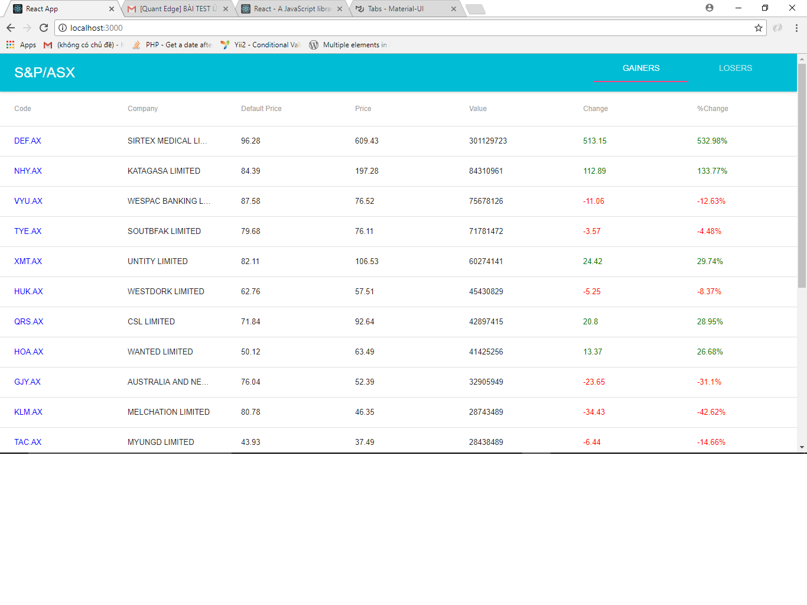

## React JS - Stock list
Bảng giá giao dịch xây dựng dựa trên React Framework


#### Yêu cầu
* Sử dụng nodeJS v7.10.0
* Sử dụng npm 4.6.1
* Sử dụng react framework v16.0.0

Cấu trúc thư mục
```
node_modules/         chứa các module của node js
    
public/               
src/                  chứa code thực thi
  Components/         chứa các component con
      gainers.js      component hiển thị top 20 cổ phiếu có giá trị giao dịch giảm dần
      losers.js       component hiển thị top 20 cổ phiếu có giá trị giao dịch tăng dần
  App.js              Component cha
  data.js             chứa dữ liệu của 30 cổ phiếu khởi tạo ban đầu
  function.js         hàm thực thi
  index.js            File này sẽ gọi component App và truyền vào index.html
```

#### Cách thực hiện ####
* Khởi tạo 30 cổ phiếu dưới dạng mảng các đối tượng trong src/data.js
* Trong component App :
    * constructor : Gán 1 state stocklists = mảng đối tượng trong file src/data.js
    * function randomInteger(min, max) : random Volumn
    * function randomFloat(min,max) : random Price
    * function changePriceAndVolumn(minVolumn, maxVolumn, minPercent, maxPercent) : Thay đổi ngẫu nhiên giá và khối lượng
    * componentDidMount : 
      * gán this.state.stocklists cho 1 cái mảng mới tên stocklists, chạy vòng lặp và random giá ban đầu và khối lượng ban đầu, setState cho stocklists bằng cái mảng vừa random
      * sau khi setState xong trong callback function sử dụng setInterval và thực thi hàm changePriceAndVolumn(10, 30, -5 , 5) để tạo ra giá và khối lượng mới mỗi 5s

    * render ra view : Tạo 2 component con là Gainers và Losers trong /Component và truyền props slists = {this.state.stocklists} cho 2 component con này
    * Trong mỗi component con sắp xếp và hiển thị ra top 20 trên tổng số 30 cổ phiếu

#### Liên hệ ####
Email : tackanoway35@gmail.com
Telephone : 01652880097
Skype : tacka35
